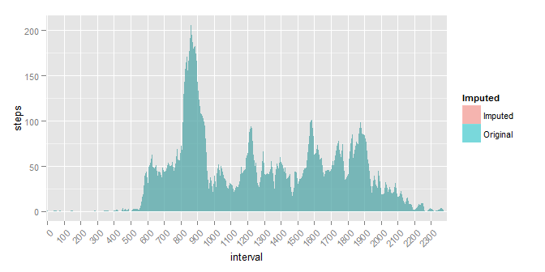
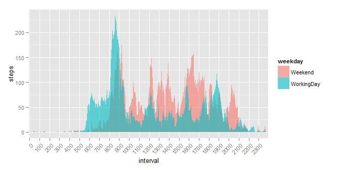

# COURSERA - Reproducible Research: Peer Assessment 1
Stanislav Gerasymenko  


## Loading and preprocessing the data

Load required packages:

```r
require(dplyr)
require(ggplot2)
require(gridExtra)
```


Set the working directory (**should be customised by the user**) and read the
data into R:

```r
wd <- paste("C:/!SG/OneDrive/Projects/SCIENCE/Coursera",
            "Coursera_05_Reproducible_Research/Course_Project1",
            "RepData_PeerAssessment1", sep = "/")
setwd(paste(wd, "INPUT", sep = "/"))
inputdf <- 
        read.csv("activity.csv")%>%
        mutate(interval = as.factor(interval))
# head(inputdf)
# str(inputdf)
# tail(inputdf)
```


## What is mean total number of steps taken per day?

Calculate the total steps walked during each day and make a histogram:

```r
totalStepsByDay <-
        inputdf %>%
        group_by(date) %>%
        summarise(steps = sum(steps))
# totalStepsByDay
```

 

Median value of steps walked during a day is:

```r
totalStepsByDay %>%
        summarise(steps = median(steps, na.rm = TRUE))
```

```
## Source: local data frame [1 x 1]
## 
##   steps
## 1 10765
```

Mean value of steps walked during a day is:

```r
totalStepsByDay %>%
        summarise(steps = mean(steps, na.rm = TRUE))
```

```
## Source: local data frame [1 x 1]
## 
##      steps
## 1 10766.19
```


## What is the average daily activity pattern?

Calculate and plot the mean steps walked during each interval over the 
whole period:

```r
totalStepsByInterval <-
        inputdf %>%
        mutate(interval = as.factor(interval)) %>%
        group_by(interval) %>%
        summarise(steps = mean(steps, na.rm = TRUE))
# str(totalStepsByInterval)
# tail(totalStepsByInterval)
```

 

Find the interval with maximum steps walked on average:

```r
totalStepsByInterval %>%
        filter(steps == max(steps))
```

```
## Source: local data frame [1 x 2]
## 
##   interval    steps
## 1      835 206.1698
```

## Imputing missing values

Calculate the number of missing values before imputing the missing values:

```r
inputdf %>%
        filter(is.na(steps)) %>%
        summarise(count = n())
```

```
##   count
## 1  2304
```

Impute the missing values with average values for the corresponding interval:

```r
temp <- left_join(inputdf, totalStepsByInterval, by = "interval")
inputdfCorrected <- inputdf
inputdfCorrected[is.na(inputdf$steps), "steps"] <- 
        temp[is.na(inputdf$steps), "steps.y"]
rm(temp)
```

Calculate the number of missing values after imputing missing values:

```r
inputdfCorrected %>%
        filter(is.na(steps)) %>%
        summarise(count = n())
```

```
##   count
## 1     0
```

Calculate the total steps walked during each day after imputing the missing 
values:

```r
totalStepsByDayCorrected <-
        inputdfCorrected %>%
        group_by(date) %>%
        summarise(steps = sum(steps))
# totalStepsByDayCorrected
```

Median value of steps walked during a day after imputing the missing values is:

```r
totalStepsByDayCorrected %>%
        summarise(steps = median(steps, na.rm = TRUE))
```

```
## Source: local data frame [1 x 1]
## 
##      steps
## 1 10766.19
```

Mean value of steps walked during a day after imputing the missing values is:

```r
totalStepsByDayCorrected %>%
        summarise(steps = mean(steps, na.rm = TRUE))
```

```
## Source: local data frame [1 x 1]
## 
##      steps
## 1 10766.19
```

Calculate the mean steps walked during each interval over the whole period after
imputing missing values:

```r
totalStepsByIntervalCorrected <-
        inputdf %>%
        mutate(interval = as.factor(interval)) %>%
        group_by(interval) %>%
        summarise(steps = mean(steps, na.rm = TRUE))
# str(totalStepsByIntervalCorrected)
# tail(totalStepsByIntervalCorrected)
```

Join original and imputed tables for convenient graphing and see the
comparisons on the plots:

```r
totalStepsByDayComparison <- rbind(totalStepsByDay, totalStepsByDayCorrected)
totalStepsByDayComparison$Imputed <- 
        rep(c("Original", "Imputed"), 
            times = c(nrow(totalStepsByDay), nrow(totalStepsByDayCorrected)))
totalStepsByDayComparison$Imputed <- 
        as.factor(totalStepsByDayComparison$Imputed)

totalStepsByIntervalComparison <- 
        rbind(totalStepsByInterval, totalStepsByIntervalCorrected)
totalStepsByIntervalComparison$Imputed <- rep(c("Original", "Imputed"),
                           times = c(nrow(totalStepsByInterval),
                                     nrow(totalStepsByIntervalCorrected)))
totalStepsByIntervalComparison$Imputed <- 
        as.factor(totalStepsByIntervalComparison$Imputed)
```

Histograms of steps walked during each day before and after imputing the missing
values:  
 

Mean steps walked during each interval over the whole period before and after 
imputing the missing values:          
 

## Are there differences in activity patterns between weekdays and weekends?

Create a factor with values WorkingDay/Weekend:

```r
Sys.setlocale("LC_TIME", "C")
```

```
## [1] "C"
```

```r
inputdfCorrected <-
        inputdf %>%
        mutate(weekday = weekdays(as.Date(date))) %>%
        mutate(weekday = ifelse(weekday == "Monday" | 
                                        weekday ==  "Tuesday" |
                                        weekday ==  "Wednesday" |
                                        weekday ==  "Thursday" | 
                                        weekday ==  "Friday", 
                                "WorkingDay", "Weekend")) %>%
        mutate(weekday = as.factor(weekday))
# str(inputdfCorrected)
```

Calculate and plot the mean steps walked during each interval 
over WorkingDay/ Weekend periods after imputing missing values:

```r
totalStepsByIntervalWeekdayCorrected <-
        inputdfCorrected %>%
        mutate(interval = as.factor(interval)) %>%
        group_by(interval, weekday) %>%
        summarise(steps = mean(steps, na.rm = TRUE))
# str(totalStepsByInterval)
# tail(totalStepsByInterval)
```

 


