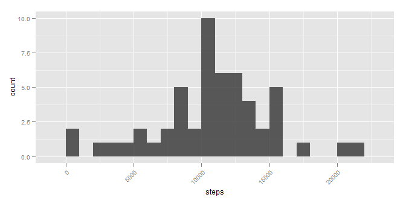
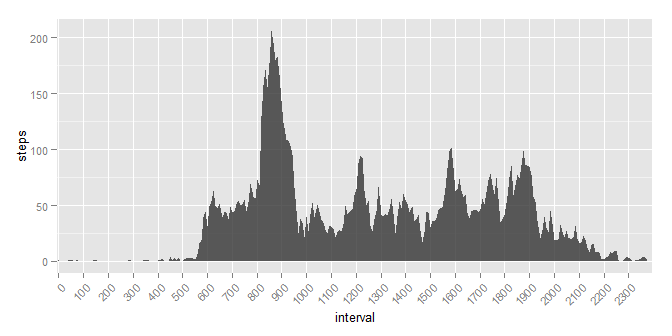
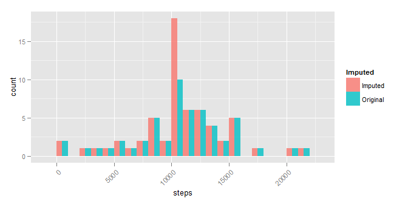
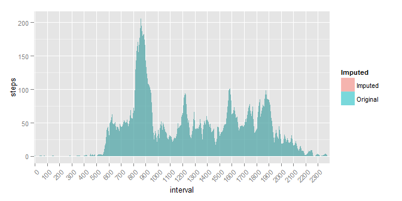
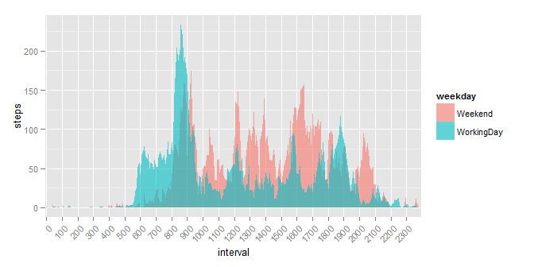

# COURSERA - Reproducible Research: Peer Assessment 1
Stanislav Gerasymenko  


## Loading and preprocessing the data

Load required packages:

```r
require(dplyr)
require(ggplot2)
require(gridExtra)
```


Set the working directory (**should be customised by the user**) and read the
data into R:


## What is mean total number of steps taken per day?

Calculate and graph the total steps walked during each day and make a histogram:


 

Median value of steps walked during a day is:

```
## Source: local data frame [1 x 1]
## 
##   steps
## 1 10765
```

Mean value of steps walked during a day is:

```
## Source: local data frame [1 x 1]
## 
##      steps
## 1 10766.19
```


## What is the average daily activity pattern?

Calculate and plot the mean steps walked during each interval over the 
whole period:


 

Find the interval with maximum steps walked on average:

```
## Source: local data frame [1 x 2]
## 
##   interval    steps
## 1      835 206.1698
```

## Imputing missing values

Calculate the number of missing values before imputing the missing values:

```
##   count
## 1  2304
```

Impute the missing values with average values for the corresponding interval:


Calculate the number of missing values after imputing missing values:

```
##   count
## 1     0
```

Calculate and graph the total steps walked during each day after imputing 
the missing values:


Median value of steps walked during a day after imputing the missing values is:

```
## Source: local data frame [1 x 1]
## 
##      steps
## 1 10766.19
```

Mean value of steps walked during a day after imputing the missing values is:

```
## Source: local data frame [1 x 1]
## 
##      steps
## 1 10766.19
```

Calculate and plot the mean steps walked during each interval over the 
whole period after imputing missing values:


Join original and imputed tables for convenient graphing in one plot and see the
comparison on the plot:


  

## Are there differences in activity patterns between weekdays and weekends?

Create a factor with values WorkingDay/Weekend:

```
## [1] "C"
```

Calculate and plot the mean steps walked during each interval 
over WorkingDay/ Weekend periods after imputing missing values:


 


